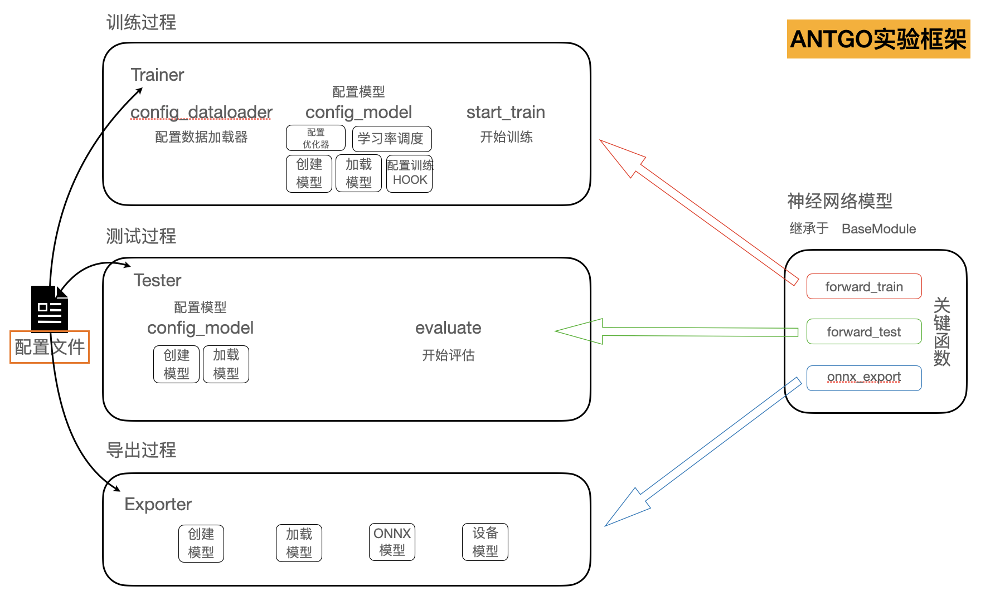

# 模型训练推理实验框架介绍

## 训练推理实验框架全局视图



## 训练推理实验框架运行流程
### 训练过程
训练过程通过Trainer类进行管理，使用config_dataloader函数来解析配置文件中的数据集配置，包括训练数据集和验证数据集。使用config_model函数来创建模型并配置相关训练信息，包括学习率调度、优化器设置、评估方法设置。模型创建阶段的所有信息均来自于配置文件。如下例子给出了pascal voc分割任务的配置文件样例，
```
# 优化器配置
optimizer = dict(type='SGD', lr=0.05,  weight_decay=5e-4, momentum=0.9, nesterov=True)
optimizer_config = dict(grad_clip=None)

# 学习率调度配置
lr_config = dict(
    policy='CosineAnnealing',
    min_lr=1e-5,
    warmup_by_epoch=False,
    warmup_iters=2000,
    warmup='linear'    
)

# 模型配置
model = dict(
    type='EncoderDecoder',
    backbone=dict(
        type='DDRKetNetF',
        in_channels=3
    ),
    decode_head=dict(
        type='SimpleHead',
        in_channels=32,
        channels=32,
        out_channels=21,
        ignore_index=255
    )
)

# 数据配置
data=dict(
    train=dict(
        type='Pascal2012',
        train_or_test='train',
        dir='./pascal2012_dataset',
        ext_params=dict(task_type='SEGMENTATION', aug=True),
        pipeline=[
            dict(type='Rotation'),
            dict(type='ResizeS', target_dim=(256,256)),
            dict(type='ColorDistort'),
            dict(type='RandomFlipImage', swap_ids=[], swap_labels=[]),
            dict(type='ToTensor', keys=['image']),
            dict(type='Normalize', mean=(0.491400, 0.482158, 0.4465231), std=(0.247032, 0.243485, 0.2615877), keys=['image']),
            dict(type='UnSqueeze', axis=0, keys=['segments'])
        ],
        inputs_def=dict(
            fields=['image', 'segments'],
        )
    ),
    train_dataloader=dict(
        samples_per_gpu=128, 
        workers_per_gpu=2,
        drop_last=True,
        shuffle=True,
    ),
    val=dict(
        type='Pascal2012',
        train_or_test='val',
        dir='./pascal2012_dataset',
        ext_params=dict(task_type='SEGMENTATION', aug=True),
        pipeline=[
            dict(type='ResizeS', target_dim=(256,256)),
            dict(type='ToTensor', keys=['image']),
            dict(type='Normalize', mean=(0.491400, 0.482158, 0.4465231), std=(0.247032, 0.243485, 0.2615877), keys=['image']),
            dict(type='UnSqueeze', axis=0, keys=['segments'])
        ],        
        inputs_def=dict(
            fields=['image', 'segments'],
        )
    ),
    val_dataloader=dict(
        samples_per_gpu=128, 
        workers_per_gpu=2,
        drop_last=False,
        shuffle=False,
    ),
    test=dict(
        type='Pascal2012',
        train_or_test='val',
        dir='./pascal2012_dataset',
        ext_params=dict(task_type='SEGMENTATION', aug=True),
        pipeline=[
            dict(type='ResizeS', target_dim=(256,256)),
            dict(type='ToTensor', keys=['image']),
            dict(type='Normalize', mean=(0.491400, 0.482158, 0.4465231), std=(0.247032, 0.243485, 0.2615877), keys=['image']),
            dict(type='UnSqueeze', axis=0, keys=['segments'])
        ],                
        inputs_def=dict(
            fields=['image', 'segments'],
        )
    ),
    test_dataloader=dict(
        samples_per_gpu=128, 
        workers_per_gpu=2,
        drop_last=False,
        shuffle=False,
    )
)

# 评估方案配置
evaluation=dict(out_dir='./output/', interval=1, metric=dict(type='SegMIOU', class_num=21), save_best='miou', rule='greater')
```

接下来便可以开始通过调用start_train(max_epochs=...)，直接开始训练。

### 测试过程
测试过程通过Tester类进行管理，通过config_model函数进行模型创建以及加载模型参数，并使用配置文件中的evaluation字段进行评估方法的设置，使用data/test字段来构建测试集。

最后通过调用evaluate()，直接开始评估。

### 导出过程
导出过程通过Exporter类进行管理，通过使用配置文件中的model字段进行模型创建，然后基于外部传入的checkpoint文件完成导出onnx模型文件的过程。

## 框架关键模块设计
由于高度标准化的设计初衷以及自动化开发流水线的需求，各个模块均需要满足设计规范。主要分为5大模块，
### 数据集模块
需要继承于Dataset(from antgo.dataflow.dataset.dataset import Dataset)，然后实现size()和sample()两个函数。具体代码示例如下，

```
from antgo.framework.helper.dataset.builder import DATASETS
from antgo.framework.helper import reader
from antgo.dataflow.dataset.dataset import Dataset
import numpy as np


@reader.register
class YourDataset(Dataset):
    def __init__(self, train_or_test="train", dir=None, ext_params=None):
        super().__init__(train_or_test, dir, ext_params)
        pass

    @property
    def size(self):
        # 返回数据集大小
        return 0

    def sample(self, id):
        # 根据id，返回对应样本 （dict类型）
        # 关键字段，image: ...，用于设置图像数据，其余字段可以自由设置
        return {}

```
通过reader.register将自定义的数据集解析类注册到系统中，从而外部代码可以通过配置文件中的类名字自动加载到对应的数据集解析类。我们可以再看一下配置文件中的数据集的配置，
```
    train=dict(
        type='Pascal2012',
        train_or_test='train',
        dir='./pascal2012_dataset',
        ext_params=dict(task_type='SEGMENTATION', aug=True),
        pipeline=[
            dict(type='Rotation'),
            dict(type='ResizeS', target_dim=(256,256)),
            dict(type='ColorDistort'),
            dict(type='RandomFlipImage', swap_ids=[], swap_labels=[]),
            dict(type='ToTensor', keys=['image']),
            dict(type='Normalize', mean=(0.491400, 0.482158, 0.4465231), std=(0.247032, 0.243485, 0.2615877), keys=['image']),
            dict(type='UnSqueeze', axis=0, keys=['segments'])
        ],
        inputs_def=dict(
            fields=['image', 'segments'],
        )
    )
```
train_or_test, dir, ext_params在创建数据集解析类时，作为初始化参数传入。inputs_def字段用于设置将数据集解析出的样本的哪些字段在模型训练时使用。以这里的配置为例，在训练时image和segments字段将抽取出来传入训练过程，其直接影响着匹配的模型的forward_train的参数，例如
```
    def forward_train(self, image, segments, **kwargs):
        ...
```

pipeline字段用于配置数据增强管线，数据增强模块的设计见下。

### 数据增强模块
允许自定义一个类，并实现\_\_call\_\_函数，通过@PIPELINES.register_module()将自定义类注册到系统中，框架通过配置文件中的数据增强的类名，自动创建对象。参考如下增强模块示例，
```
from antgo.framework.helper.dataset.builder import PIPELINES

@PIPELINES.register_module()
class INormalize(object):
    """Normalize the image.

    Args:
        mean (sequence): Mean values of 3 channels.
        std (sequence): Std values of 3 channels.
        to_rgb (bool): Whether to convert the image from BGR to RGB,
            default is true.
    """

    def __init__(self, mean, std, to_rgb=False, keys=['image']):
        self.mean = np.array(mean, dtype=np.float32)
        self.std = np.array(std, dtype=np.float32)
        self.to_rgb = to_rgb
        self.keys = keys

    def __call__(self, results):
        for key in self.keys:
            results[key] = imnormalize(results[key], self.mean, self.std,
                                            self.to_rgb)

        if 'image_meta' in results:
            results['image_meta']['img_norm_cfg'] = \
                dict(mean=self.mean, std=self.std, to_rgb=self.to_rgb)
        return results

```

### 模型构建模块
需要继承于BaseModule（from antgo.framework.helper.runner import BaseModule），示例代码如下，
```
import torch
import torch.nn as nn
import torch.nn.functional as F
from antgo.framework.helper.models.builder import HEADS, MODELS
from antgo.framework.helper.runner import BaseModule

@MODELS.register_module()
class EncoderDecoder(BaseModule):
    def __init__(self,
                 backbone,
                 decode_head,
                 neck = None,
                 train_cfg = None,
                 test_cfg = None,
                 init_cfg = None):
        super().__init__(init_cfg=init_cfg)
        self.backbone = MODELS.build(backbone)
        self.with_neck = False
        if neck is not None:
            self.neck = MODELS.build(neck)
            self.with_neck = True

        self.decode_head = HEADS.build(decode_head)
        self.train_cfg = train_cfg
        self.test_cfg = test_cfg

    def extract_feat(self, image):
        """Extract features from images."""
        x = self.backbone(image)
        if self.with_neck:
            x = self.neck(x)
        return x

    def forward_train(self, image, segments, **kwargs):
        x = self.extract_feat(image)
        x = self.decode_head(x)

        losses = dict()
        loss_decode = \
            self.decode_head.loss(x, segments.long())
        losses.update(loss_decode)
        return losses

    def forward_test(self, image, **kwargs):
        x = self.extract_feat(image)
        seg_predict = self.decode_head.simple_test(x)
        seg_predict = F.interpolate(seg_predict, size=(image.shape[2:]), mode='bilinear')
        seg_predict = torch.argmax(seg_predict, 1)
        return {
            'pred_segments': seg_predict
        }

    def onnx_export(self, image):
        feat = self.extract_feat(image)
        seg_predict = self.decode_head.simple_test(feat)
        return seg_predict
```
一个模型需要完成三个函数的定义，
* forward_train
  
    在训练阶段使用，传入的参数跟对接数据集有关（见配置文件中的数据字段的inputs_def定义）。此函数返回模型的损失值（dict 类型），允许多个不同损失函数定义，框架自动合并损失值并进行梯度计算。
* forward_test
  
    在评估/测试阶段使用，返回值需要根据不同的任务类型有不同的字段定义，例如

    * 分割任务

        {'pred_segments': ...}
    * 检测任务

        {'box': ..., 'label': ...}
    * 2D关键点任务

        {'pred_joints2d': ...}
    * 分类任务

        {'pred', ...}

最后通过@MODELS.register_module()将模型注册到系统中，从而框架可以直接通过配置文件中的模型类名字，自动创建模型。

* onnx_export
    
    在模型导出阶段使用。为了保证模型导出尽可能简洁，在这一函数中应该仅包含模型的主要结构，去除冗余的操作。


### 指标评估模块
评估类的定义，需要实现keys(), \_\_call\_\_()两个函数，其中keys()函数需要返回如何从GT中抽取评估需要的字段数据，如何从模型forward_test返回的信息中抽取评估需要的字段数据。
```
from antgo.framework.helper.runner.builder import *
import numpy as np

@MEASURES.register_module()
class SegMIOU(object):
    def __init__(self, class_num, ignore_val=255) -> None:
        self.ignore_val = ignore_val
        self.class_num = class_num
    
    def keys(self):
        return {'pred': ['pred_segments'], 'gt':['segments']}
    
    def _fast_hist(self, label_pred, label_true):
        # 找出标签中需要计算的类别,去掉了背景
        mask = (label_true >= 0) & (label_true < self.class_num) & (label_true != self.ignore_val)

        # # np.bincount计算了从0到n**2-1这n**2个数中每个数出现的次数，返回值形状(n, n)
        hist = np.bincount(
            self.class_num * label_true[mask].astype(np.int) +
            label_pred[mask].astype(np.int), minlength=self.class_num ** 2).reshape(self.class_num, self.class_num)
        return hist

    def __call__(self, preds, gts):
        confusion = np.zeros((self.class_num, self.class_num))
        for pred, gt in zip(preds, gts):
            sample_confusion = self._fast_hist(np.array(pred['pred_segments']).flatten(), np.array(gt['segments']).flatten())
            confusion += sample_confusion

        iou = np.diag(confusion) / np.maximum(1.0,confusion.sum(axis=1) + confusion.sum(axis=0) - np.diag(confusion))
        miou_val = float(np.nanmean(iou))

        print()
        print("======== MIOU Acc: %f ========" % (miou_val))
        error_info = {
            'miou': miou_val
        }
        return error_info
```

最后通过@MEASURES.register_module()将评估类注册到系统中，从而框架可以通过配置文件自动加载配置类。
### 配置文件结构

配置文件中的字段以及含义

* 优化器配置字段
    例如，
    ```
    optimizer = dict(type='SGD', lr=0.05,  weight_decay=5e-4, momentum=0.9, nesterov=True)
    optimizer_config = dict(grad_clip=None)
    ```
* 学习率调度字段
    ```
    lr_config = dict(
        policy='CosineAnnealing',
        min_lr=1e-5,
        warmup_by_epoch=False,
        warmup_iters=2000,
        warmup='linear'    
    )
    ```
* 日志配置字段
    ```
    log_config = dict(
        interval=10,    
        hooks=[
        dict(type='TextLoggerHook'),
        ])
    ```
    interval用来指定间隔多少迭代，进行一次日志输出。

* 模型配置字段
    ```
    model = dict(
        type='EncoderDecoder',
        backbone=dict(
            type='DDRKetNetF',
            in_channels=3
        ),
        decode_head=dict(
            type='SimpleHead',
            in_channels=32,
            channels=32,
            out_channels=21,
            ignore_index=255
        )
    )
    ```
* 模型基本信息字段
* checkpoint字段
    ```
    checkpoint_config = dict(interval=1, out_dir='./output/')       
    ```
    interval用来指定间隔多少epoch保存一次checkpoint,out_dir用来指定保存目录。
* 数据配置字段
    ```
    data=dict(
        train=dict(),
        val=dict(),
        test=dict()
    )
    ```
    train字段是指定训练数据集，val字段指定在训练阶段的评估数据集，test字段指定在测试阶段的测试数据集。具体数据集的定义见上面的数据集模块设计。
* 评估设置字段
    ```
    evaluation=dict(out_dir='./output/', interval=1, metric=dict(type='SegMIOU', class_num=21), save_best='miou', rule='greater')

    ```
  metric字段用于指定评估类的定义。
* 导出设置字段
    ```
    export=dict(
        input_shape_list = [[1,3,256,256]],
        input_name_list=["image"],
        output_name_list=["heatmap"]
    )
    ```
    设置模型导出时，导出必备的信息，包括输入tensor的形状、名字，和输出的名字。

## pascal voc分割任务
