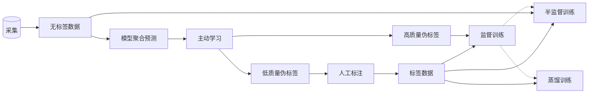

# 简明教程

## 安装代码库
```
pip3 install antgo
```

## 快速体验模型训练（Cifar10）
```
# 第一步 创建mvp代码（Cifar10分类任务训练）
antgo create mvp

# 第二步 开始训练（使用GPU 0）
python3 ./cifar10/main.py --exp=cifar10 --gpu-id=0 --process=train

# 第三步 查看训练日志
# 在./output/cifar10/output/checkpoint下你将获得checkpoint epoch_1500.pth
# 在测试集上的top-1指标约为0.95

# 第四步 导出onnx模型
python3 ./cifar10/main.py --exp=cifar10 --checkpoint=./output/cifar10/output/checkpoint/epoch_1500.pth --process=export
```

## 开发自定义模型

### 第一步 基于mvp构建模板代码（基于Cifar10分类任务的代码）
```
antgo create mvp --name=mycls
```
将在当前目录下生成模板代码，如下格式
```
|-- mycls
    |-- configs
        |-- config.py
    |-- models
        |-- wideres.py
    |-- __init__.py
    |-- dataset.py
    |-- hooks.py
    |-- metrics.py
    |-- main.py
|-- install.sh
|-- launch.sh
|-- system.py
|-- README.md
|-- requirements.txt
```

### 第二步 基于模板进行修改
* 自定义数据集

转换数据到标准格式

> 场景1
> 
> 图片样本在一个文件夹中，我们使用如下工具将样本组织成标准格式，
> ```
> # --max-size 用于指定图片长边最大值
> antgo tool extract/images --src=图片目录地址 --tgt=目标地址 --prefix=文件名前缀过滤 --suffix=文件名后缀过滤 --ext=文件扩展名过滤 --shuffle --max-size=256
> ```

> 场景2
> 
> 从视频文件中采样，我们使用如下工具将样本组织成标准格式，
> ```
> antgo tool extract/videos --src=视频文件目录地址 --tgt=目标地址 --frame-rate=15 --max-size=256
> ```

> 场景3
>
> 转换标准coco格式数据，到标准格式
> ```
> antgo tool extract/coco --src=coco格式的json文件地址 --tgt=目标地址
> ```

> 场景4
> 
> 基于标准格式数据，裁切出目标局部区域，并重新组织成标准格式
> （对局部区域进行进行化分析时，经常使用）
> ```
> # --ext-ratio 用于指定如何对目标框进行外扩
> antgo tool extract/crop --src= --tgt=目标地址 --ext-ratio=0.3
> ```


基于标准格式进行tfrecord训练数据打包

> 
```
# --num 指定打包后单个文件中的样本数量
antgo tool package/tfrecord --src=在第一步转换好的地址下的json文件路径 --tgt=打包目标路径 --prefix=打包后文件名前缀指定 --num=40000
```
打包后，打包文件样式如下
```
|-- package
    |-- yongchun_hand_gesture-00000-of-00003-index
    |-- yongchun_hand_gesture-00000-of-00003-tfrecord
    |-- yongchun_hand_gesture-00001-of-00003-index
    |-- yongchun_hand_gesture-00001-of-00003-tfrecord
    |-- yongchun_hand_gesture-00002-of-00003-index
    |-- yongchun_hand_gesture-00002-of-00003-tfrecord
```

修改配置文件中的数据配置字段
```
|-- mycls
    |-- configs
        |-- config.py
```

```
# 修改点1：
# data_path_list，中添加打包好的数据文件 ***.tfrecord
# 修改点2
# pipeline，中添加合适的数据增强算子（这里以分类模型为例，给出了常用的增强方案）
# 框架中兼容了tochvision包提供的所有增强算子，也实现了大量的扩展数据增强算子，详见antgo/dataflow/imgaug/operators.py

data=dict(
    train=dict(
        type="TFDataset",
        data_path_list=[],
        pipeline=[    
            dict(type='Meta', keys=['image_file', 'tag']),
            dict(type='INumpyToPIL', keys=['image'], mode='RGB'),
            dict(type='RandomHorizontalFlip', keys=['image']),
            dict(type='RandomCrop', size=(32,32), padding=int(32*0.125), fill=128, padding_mode='constant', keys=['image']), 
            dict(type='ToTensor', keys=['image']),
            dict(type='Normalize', mean=(0.491400, 0.482158, 0.4465231), std=(0.247032, 0.243485, 0.2615877), keys=['image']),
        ],
        inputs_def={'fields': ['image', 'label', 'image_meta']},
        description={'image': 'numpy', 'label': 'int', 'image_file': 'str', 'tag': 'str'}
    ),
    train_dataloader=dict(
        samples_per_gpu=128, 
        workers_per_gpu=2,
        drop_last=True,
        shuffle=True,
    ),    
    val=dict(
        type="TFDataset",
        data_path_list=[],
        pipeline=[    
            dict(type='Meta', keys=['image_file', 'tag']),
            dict(type='INumpyToPIL', keys=['image'], mode='RGB'),                  
            dict(type='ToTensor', keys=['image']),
            dict(type='Normalize', mean=(0.491400, 0.482158, 0.4465231), std=(0.247032, 0.243485, 0.2615877), keys=['image']),                  
        ],
        inputs_def={'fields': ['image', 'label', 'image_meta']},
        description={'image': 'numpy', 'label': 'int', 'image_file': 'str', 'tag': 'str'}
    ),
    val_dataloader=dict(
        samples_per_gpu=128, 
        workers_per_gpu=2,
        drop_last=False,
        shuffle=False,
    ),   
    test=dict(
        type="TFDataset",
        data_path_list=[],
        pipeline=[    
            dict(type='Meta', keys=['image_file', 'tag']),
            dict(type='INumpyToPIL', keys=['image'], mode='RGB'),                  
            dict(type='ToTensor', keys=['image']),
            dict(type='Normalize', mean=(0.491400, 0.482158, 0.4465231), std=(0.247032, 0.243485, 0.2615877), keys=['image']),                  
        ],
        inputs_def={'fields': ['image', 'label', 'image_meta']},
        description={'image': 'numpy', 'label': 'int', 'image_file': 'str', 'tag': 'str'},
    ),
    test_dataloader=dict(
        samples_per_gpu=128, 
        workers_per_gpu=2,
        drop_last=False,
        shuffle=False,
    )
)
```

* 自定义模型

系统采用注册机制实现模块的动态构建。所以我们可以在任何位置实现模型的定义，并注册到系统中。

举例来说，见文件，这里自定义了wideres backebone的模型定义，
```
|-- mycls
    |-- models
        |-- wideres.py
```

```
@MODELS.register_module()
class WideResNet(nn.Module):
    def __init__(self, num_classes, depth=28, widen_factor=2, dropout=0.0, dense_dropout=0.0, **kwargs):
        ......
```

这行代码，实现模型到系统的注册。

```
@MODELS.register_module()
```
然后我们从模型配置文件中，可以看到如何配置我们自定义的模型，见下
```
# 模型配置
model = dict(
    type='ImageClassifier',
    backbone=dict(
        type='WideResNet',
        num_classes=4,     
        depth=28,
        widen_factor=8,
        dropout=0,
        dense_dropout=0.2          
    ),
    head=dict(
        type='ClsHead',
        loss=dict(type='CrossEntropyLoss', loss_weight=1.0, class_weight=[100,3,1,2])
    )
)
```
这里，我们将自定义的WideResNet作为分类模型ImageClassifier的backbone使用了。


* 模型训练

同样的模型训练方式
```
python3 ./mycls/main.py --exp=mycls --gpu-id=0 --process=train
```

* 导出onnx模型

同样的模型导出方式
```
python3 ./mycls/main.py --exp=mycls --checkpoint=./output/mycls/output/checkpoint/epoch_xxx.pth --process=export
```

## 常用研发工具
### 转换视频数据到标准训练格式
```
antgo tool extract/videos --src=video-folder --tgt=target-folder --frame-rate=15 
// 如果需要指定抽取后的最长边大小，可以调用
antgo tool extract/videos --src=video-folder --tgt=target-folder --frame-rate=15 --max-size=512
```
### 转换松散数据到标准训练格式
```
antgo tool extract/images --src=image-folder --tgt=target-folder

// 如果同时想要指定文件名前缀，后缀，扩展名进行过滤，可以如下，
antgo tool extract/images --src=image-folder --tgt=target-folder --prefix=prefix --suffix=suffix 
--ext=ext

// 如果想要指定是否乱序，最大抽取图像数，以及最长边大小，可以调用
antgo tool extract/images --src=image-folder --tgt=target-folder --shuffle --num=5000 --max-size=512
```
### 转换COCO格式数据到标准训练格式
```
# --tags用于指定原格式下的类别标签映射到新格式下的类别索引
antgo tool extract/coco --src=coco-json-path --tgt=target-folder --tags=hand:0
```

### 转换到实例图数据并重新生成标准训练格式
```
antgo tool extract/crop --src=json-path --tgt=target-folder
```


### 从第三方提供的json/txt标注文件中随机采样
```
// 用于查看GT格式
antgo tool extract/samples --src=json-path --num=1 --feedback
```
### 从baidu/bing/vcg/aliyun下载图像/视频
```
// --tags 用于指定下载关键词； type:image,keyword:aa/bb 标识下载图像，关键词是aa,bb
// -num 用于指定下载样本数

# 从baidu下载指定关键字的图片
antgo tool download/baidu --tags=type:image,keyword:dog/cat --num=5000

# 从bing下载指定关键字的图片
antgo tool download/bing --tags=type:image,keyword:dog/cat --num=5000

# 从视觉中国下载指定关键字的图片
antgo tool download/vcg --tags=type:image,keyword:dog/cat --num=5000

# 从阿里云盘下载指定文件或文件夹,--src=设置云盘上的文件或文件夹路径
antgo tool download/aliyun --src=...
```

### 浏览样本数据 (仅支持标准GT格式)
```
antgo tool browser/images --src=json-path 
// 如果想要在浏览数据时，给样本快速打标签（一般用于审核数据时使用）
// 使用--tags来设置标签
antgo tool browser/images --src=json-path --tags=valid,invalid --feedback

// 仅web页面显示，并允许在页面输入GT格式文件
antgo tool browser/images --user-input
```

### 使用标签过滤样本（仅支持标准GT格式）
```
// 使用来自于数据浏览服务获得的样本标签记录，进行过滤
// --tags 指定需要含有的标签
// --no-tags 指定不可以包含的标签
antgo tool filter/tags --src=json-path --tgt=from-browser-json --tags=tags --no-tags=no-tags
```

### 标注工具集成（仅支持标准GT格式）
```
// 转换label-studio标注工具结果到标准GT格式
// 如果有必要，加入--prefix来将路径加上子目录
antgo tool label/studio --src=json-path --tgt=target-folder --tags=lefthand:0,righthand:1 --from
// 将标准GT格式转换到label-studio标注工具结果
antgo tool label/studio --src=json-path --tgt=target-folder --to

// 合并标注结果
antgo tool label/merge --src=json-path,json-path --tgt=target-folder --to

// 启动标注服务
// --type 支持RECT,POLYGON
// --tags 设置类型标签，例如Car:0,Train:1
antgo tool label/start --src=json-path --tgt=target-folder --tags=Car:0,Train:1 --type=RECT 
```

### 打包tfrecord/kv数据（仅支持标准GT格式）
```
// tfrecord
// --src  json文件地址(多文件的话以逗号","隔开)， --tgt 打包后存放地址，--prefix 打包后文件前缀设置，--num 打包后每个文件样本数
antgo tool package/tfrecord --src=json-path --tgt=target-folder --prefix=xxx --num=50000

// kv
// --src  json文件地址(多文件的话以逗号","隔开)， --tgt 打包后存放地址，--prefix 打包后文件前缀设置，--num 打包后每个文件样本数
antgo tool package/kv --src=json-path --tgt=target-folder --prefix=xxx --num=50000
```

## 高阶应用——模型迭代自动化流水线

开始进入我们的高级应用，全力解放无意义的码代码。数据驱动模型迭代流水线，


### 配置任务自动化提交脚本

* 基于SSH任务提交

生成默认配置 ssh-submit-config.yaml
```
antgo submitter template --ssh
```
替换，如下
```
config:
    username: yourname
    password: '' # 不启用，ssh需要开通免密登陆
    ip: your machine ip address
```

将更新的配置文件，注册到系统
```
antgo submitter update --ssh --config=ssh-submit-config.yaml
```

查找所有配置过的远程地址
```
antgo submitter ls --ssh

# 输出，远程地址ip
# xxx.xxx.xxx.xxx
```

切换到指定远程地址
```
# 需要确保这里指定的ip，是之前已经注册到系统中的
antgo submitter select --ip=xxx.xxx.xxx.xx --ssh
```

* 基于自定义脚本任务提交

脚本功能和接口规范

> 脚本功能/职责
> 
> * 提交脚本需要负责把当前目录下的代码环境打包上传到目标机器，基于指定镜像调用启动命令
>
> 脚本参数
> 
> * 镜像名称, 启动命令, GPU数, CPU数, 内存大小(单位M)
> image, launch_argv, gpu_num, cpu_num, memory_size


生成脚本配置文件 submit-config.yaml
```
antgo submitter
```
替换，如下
```
# folder 设置你的提交脚本代码文件夹路径
# script 设置提交脚本文件路径
folder: 'replace with your submit code folder'
script: 'replace with your launch script'
```

脚本注册到系统
```
antgo submitter --config=submit-config.yaml
```

### 配置私有远程存储
默认情况，使用阿里云盘作为远程存储。如果使用其他存储，需要自行实现相关操作。


### 启动服务
用来监控实验完成情况，并启动自动化优化流水线
```
antgo server --root=ali:///project
```

### 项目创建
```
# --auto，项目将执行自动优化流水线
# --image，指定项目使用的基础镜像，如果不设置，将设置为antgo默认镜像环境
# 注意，调用创建命令前，项目代码需要提前拥有git仓库。
# 注意，项目名称自动以projectgit的后缀命名
antgo create project --git=projectgit --image=image
```

#### 项目组织结构
项目将拥有类似如下的组织结构
```
|-- mycls1
    |-- configs
        |-- config.py
    |-- models
        |-- wideres.py
    |-- __init__.py
    |-- dataset.py
    |-- hooks.py
    |-- metrics.py
    |-- main.py
|-- mycls2
    |-- configs
        |-- config.py
    |-- models
        |-- wideres.py
    |-- __init__.py
    |-- dataset.py
    |-- hooks.py
    |-- metrics.py
    |-- main.py
|-- install.sh
|-- launch.sh
|-- system.py
|-- README.md
|-- requirements.txt
```
这里mycls1，mycls2是这个项目下的两个不同的实验。一个项目下面允许存在多个不同的实验，比如说可以把不同的模型作为不同的实验。

在一个项目中，拥有三种抽象的模型种类

* 专家模型

    主要是指参数量或计算量较大的模型，指标较好，但是不能实际部署
* 产品模型

    主要是指能够实现线上部署的模型
* Baseline模型

    主要是指基础模型，常作为PK对象存在

#### 配置项目信息
* 提交配置

为项目设置如何自动化提交任务
```
# --ssh，是指使用ssh提交任务，需要提前配置好 基于ssh任务提交信息。（如果不指定，则将使用用户自定义的任务提交方案，如果没有设置，则无法实现自动提交。）
# --project 设置更新的项目名称
# --gpu GPU数
# --cpu CPU数
# --memory 内存大小（单位M）
antgo update project/submitter --gpu=1 --cpu=10 --memory=10000 --project=projectname
```

* 标注配置

    创建label_config.py配置文件，在文件中设置如下字段
    
    * type  

        标注类别，目前支持CLASS,RECT,POINT,SKELETON
    * category

        样本类别，比如检测目标类别，["car", "train", "person"]
    * meta

        如果标注类别是SKELETON，则还需提供meta信息的定义，用于指定点之间的连接关系。meta=dict(skeleton=[])
```
antgo update project/label --config=label_config.py --project=projectname
```

* 半监督训练配置

    创建semi_config.py配置文件，在文件中设置半监督模型配置，可以参考框架自带的 dense 半监督算法的配置 antgo/framework/helper/configs/semi/dense_config.py。如果使用系统自带的方案，可以通过设置--name= 使用。注意，目前支持dense(适用于检测任务), mpl(适用于分类任务)
```
# 使用semi_config.py配置
antgo update project/semi --config=semi_config.py --project=projectname

# 如果要清空配置，则运行
antgo update project/semi --name= --config= --project=projectname
```

* 蒸馏训练配置

    创建distillation_config.py 是配置文件，在文件中设置蒸馏模型配置
```
antgo update project/distillation --config=distillation_config.py --project=projectname

# 如果要清空配置，则运行
antgo update project/distillation --name= --config= --project=projectname
```

* 主动学习配置

    创建ac_config.py 是配置文件信息，在文件中设置主动学习模型配置，可以参考框架自带的主动学习算法配置 antgo/framework/helper/configs/activelearning/ac_config.py

```
antgo update project/activelearning --config=ac_config.py --project=projectname

# 如果要清空配置，则运行
antgo update project/activelearning --name= --config= --project=projectname
```

* 添加产品模型
```
# 注意，一个项目仅能存在一个产品模型，多次添加会覆盖之前的。
# --exp 指定将现存的哪个实验模型作为产品模型
# --project 指定针对的是哪个项目
antgo add product --exp=expname --project=projectname
```

* 添加专家模型
```
# 注意，一个项目能存在多个专家模型。
# --exp 指定将现存的哪个实验模型作为专家模型
# --id 指定具体实验id （可以通过 antgo show exp --project=projectname 查看具体实验信息）
# --project 指定针对的是哪个项目
antgo add expert --exp=expname --id=xxx --project=projectname
```

* 添加Baseline模型
```
# 注意，一个项目仅能存在一个Baseline模型，多次添加会覆盖之前的。
# --exp 指定将现存的哪个实验模型作为基准模型
# --id 指定具体实验id （可以通过 antgo show exp --project=projectname 查看具体实验信息）
# --project 指定针对的是哪个项目
antgo add baseline --exp=expname --id=xxx --project=projectname
```

### 项目查看
```
antgo show project
antgo show project --project=projectname
```
### 实验创建
```
antgo create exp --project=projectname --name=expname
```
### 实验查看
```
antgo show exp --project=projectname
```

### 训练实验
```
# 基于ssh进行训练任务提交
antgo train --exp=expname --project=projectname --root=ali:///project --gpu-id=0 --cloud --ssh
```

### 提交新增有标签数据
```
# --project 设置为哪个项目添加无标签数据
# --address 打包好的无标签数据地址 (支持ali://云盘)
# --tags 为此数据设置一个标记
# --num 数据量
antgo add train/label --tags= --num= --address= --project=projectname
```

### 提交新增无标签数据
```
# --project 设置为哪个项目添加无标签数据
# --address 打包好的无标签数据地址
# --tags 为此数据设置一个标记
# --num 数据量
antgo add train/unlabel --tags= --num= --address= --project=projectname
```

## 辅助工具
### 模型DEMO创建
```
    import sys
    import numpy as np

    from antgo.interactcontext import InteractContext
    ctx = InteractContext()

    ctx.demo.start("b_exp", config={
            'support_user_upload': True,
            'support_user_input': False,
    })
    for data, info in ctx.demo.running_dataset.iterator_value():
        # 在此处接受传入的数据，并使用模型处理

        print(data)

        # 将模型运行结果返回
        ctx.recorder.record({
            'id': info['id'],
            'score': {
                'data': np.random.randint(0,255,(255,255), dtype=np.uint8),
                'type': 'IMAGE'
            },
            'description': {
                'data': 'hello the world',
                'type': 'STRING'
            }
        })
        print('finish')
    ctx.demo.exit()

```
### 数据查验

```
    import sys
    import numpy as np

    from antgo.interactcontext import InteractContext
    ctx = InteractContext()

    # 创建浏览服务，默认会开启本地http服务
    # tags: 设置查验标签
    # white_users: 设置允许参与查验的用户信息
    ctx.browser.start("b_exp", config = {
            'tags': ['hello', 'world'],
            'white_users': {'jian@baidu.com': {'password': '112233'}},
        })

    # 导入数据
    for id in range(10):
        ctx.recorder.record({
            'id': id,
            'score': {
                'data': np.random.randint(0,255,(255,255), dtype=np.uint8),
                'type': 'IMAGE'
            },
            'description': {
                'data': f'hello the world {id}',
                'type': 'STRING'
            }
        })
    
    # 只有在web页面上，对所有数据检查完备后返回
    ctx.browser.waiting()

    # 下载检查结果
    content = ctx.browser.download()
    print(content)
    ctx.browser.exit()
```

### 数据标注工具

这是主动学习的标注模块。
```
    import sys
    import numpy as np

    from antgo.interactcontext import InteractContext
    ctx = InteractContext()

    # 需要在这里设置标注配置信息，如
    # category: 设置类别信息
    # white_users: 设置允许参与的标注人员信息
    # label_type: 设置标注类型，目前仅支持'RECT','POINT','POLYGON'
    ctx.activelearning.start("b_exp", config={
            'metas':{
                'category': [
                    {
                        'class_name': 'A',
                        'class_index': 0,
                    },
                    {
                        'class_name': 'B',
                        'class_index': 1,           
                    }
                ]
            },
            'white_users': {'jian@baidu.com': {'password': '112233'}},
            'label_type': 'RECT',   # 设置标注类型，'RECT','POINT','POLYGON'
        }
    )

    # 切换到标注状态
    ctx.activelearning.labeling()

    # 动态添加需要标注的样本
    for i in range(10):
        # 添加等待标注样本
        ctx.recorder.record(
            {
                'id': i,
                'image': np.random.randint(0,255,(255,255), dtype=np.uint8)
            }
        )

    # 下载当前标注结果（后台等待标注完成后，再下载）
    result = ctx.activelearning.download()

    # 切换到等待状态
    ctx.activelearning.waiting()

    # 全局结束
    ctx.activelearning.exit()
```